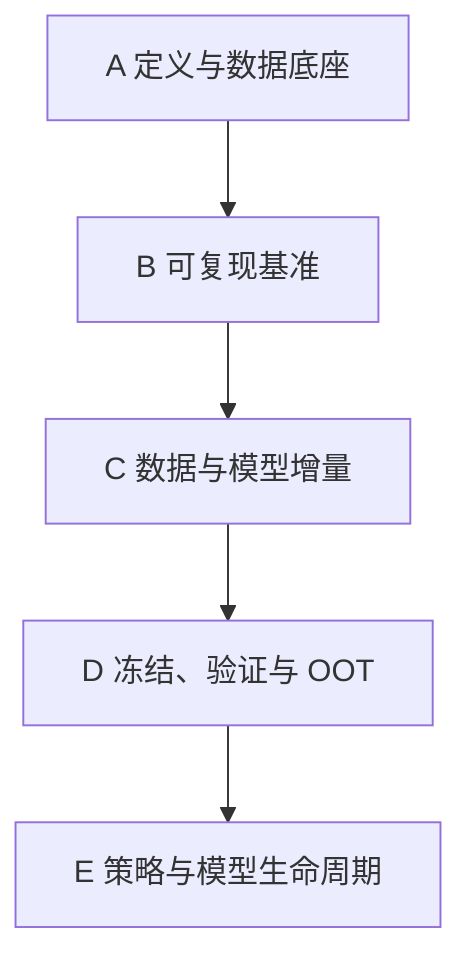

# 20｜Home Credit 2024 全流程执行手册（冻结版 v3.0）

> 本页是项目唯一执行路线。除 [[project_charter]] 规定的重大变更条件外，不再改动主流程。

## 总流程

`Charter → 数据审计 → 时间切分/锁定 OOT → D0 Feature Mart → Scorecard/RF/LightGBM → 不平衡消融 → Depth1/2 → PIT/稳定性 → 调优/校准/SHAP → 候选冻结 → 独立式验证 → Final OOT → 策略回放 → 监控/缓释 → A/B 与 Power BI`

---

# Phase A｜定义与数据底座

## Step 0｜Charter、用途与模型风险边界

**目的：**先定义预测问题、允许用途和禁止用途。

**执行：**

- 固定 `case_id`、`date_decision`、`target`；
- 只称 target event / target-event probability；
- 定义 intended use、prohibited use、初步 operating boundaries；
- 建立模型台账模板和比例化风险分级；
- 冻结 Final OOT 使用规则。

**输出：**[[project_charter]]、[[model_governance]]

**停止条件：**target、主键或时间含义存在未记录的关键不确定性。

## Step 1｜文件级数据审计

**目的：**搞清约 26GB、138 个文件的真实结构，不盲目加载。

**执行：**

1. 下载 Parquet，原始文件只读；
2. 读取 `feature_definitions.csv`；
3. 建立文件 inventory：文件、大小、表组、depth、train/test、分片；
4. 统计 schema、行数、主键候选和时间字段；
5. 形成表目录。

**输出：**`metadata/file_inventory.csv`、`metadata/table_catalog.md`

**审计点：**138 个文件不等于 138 张业务表；分片和表组必须区分。

## Step 2｜标签、主键与周度时间审计

**目的：**先理解样本轴，再设计验证。

**执行：**

- `case_id` 唯一性与重复客户可能性；
- `date_decision`、`WEEK_NUM` 范围；
- 每周样本量、target-event rate 和事件数；
- 缺失/异常周、单类别周和标签成熟问题；
- 官方 target 语义证据更新。

**输出：**`reports/01_base_time_target_audit.md`

**连接：**[[target_evidence]]、[[Inbox/target]]

## Step 3｜时间切分并锁定 Final OOT

**目的：**把开发证据与最终未来检验分开。

**执行：**

- Model Train：学习特征处理和模型；
- Tuning Validation：特征、模型、参数选择；
- Calibration/Policy Validation：概率映射和策略；
- Final OOT：最新有标签周，候选与验证报告冻结后只开一次。

具体周界限由 Step 2 的样本/事件数决定，写入 `configs/split_v1.yaml`。若样本不足以四分，采用时间顺序 OOF 或合并校准区，并记录偏差。

**禁止：**在全量数据上先分箱、填充、编码、筛选或 SMOTE；开发期读取 Final OOT 指标。

**输出：**split 配置、每段样本/事件统计、OOT access log。

---

# Phase B｜可复现基准

## Step 4｜Depth0 Feature Mart

**目的：**用 base + depth=0 跑通端到端链路。

**执行：**

- 合并 `train_base`、`static_0`、`static_cb_0`；
- 检查粒度、JOIN 前后行数、重复、类型、缺失、类别基数；
- 审计特征在 `date_decision` 时是否可用；
- 所有处理规则只在 Train 学习。

**输出：**`feature_mart_D0.parquet`、schema 和数据质量报告。

## Step 5｜三模型基准

**目的：**建立公平、可解释且足够强的参考系。

| 模型 | 角色 | 约束 |
|---|---|---|
| Logistic/WOE Scorecard | 低复杂度基准 | Train-only 分箱/WOE/IV；匿名字段下不冒充监管评分卡 |
| Random Forest | 非 Boosting 固定参考 | 固定有限参数，不展开大规模调参 |
| LightGBM | 主要 challenger | 基础参数、early stopping、固定 seed |

三者使用同一标签、切分、Feature Mart 和指标口径。

**输出：**`M0_scorecard`、`M1_rf_reference`、`M2_lgbm_baseline`

## Step 6｜基准诊断与不确定性

**目的：**区分“排序好、概率准、阈值合适”三件事。

**执行：**

- 排序：AUC、KS、PR-AUC、Lift；
- 概率：Brier、Log Loss、校准曲线；
- 明确阈值后：Recall、Precision、Specificity、G-Mean；
- 时间：weekly AUC/Gini、样本量、事件数、趋势；
- 不确定性：按实际独立单位选择 case/group/week bootstrap 或适当区间估计。

**输出：**`reports/02_baseline_diagnosis.md`

**注意：**Accuracy 不作为类别不平衡任务的核心模型选择指标。

## Step 7｜类别不平衡消融

**目的：**验证不平衡处理是否真正改善目标，而不是预设 SMOTE 有效。

**固定比较：**

1. 原始训练分布；
2. class weight；
3. 不改变训练分布、只调整策略阈值；
4. SMOTE（仅 Train，可选）。

Validation、Calibration、Final OOT 保持自然分布。比较 AUC/PR-AUC、Recall/Specificity/G-Mean、校准和策略权衡。

**输出：**`reports/03_imbalance_ablation.md`

**决策：**没有稳定增量或校准代价过大则 Drop。

---

# Phase C｜数据与模型增量

## Step 8｜Depth1 分组增量

**目的：**测量每个历史表组的边际价值。

按表组逐个完成：

`明细 → case_id 聚合 → PIT 审计 → 新 Feature Mart → 固定模型复跑 → Keep/Drop`

记录 ΔTemporal-Val 指标、周度稳定性、特征数、内存和运行时间。禁止多张明细表直接 JOIN。

## Step 9｜Depth2 两级聚合

**目的：**利用嵌套历史信息并控制 Row Explosion。

`(case_id, num_group1, num_group2) → (case_id, num_group1) → case_id`

保存每次聚合/JOIN 前后行数、unique case、重复、资源成本和单元测试。

## Step 10｜PIT、来源与特征稳定性审计

**目的：**拒绝“很强但未来不可用”的特征。

对候选和重要特征检查：

- 官方定义、来源表、depth、聚合公式；
- `date_decision` 时可用性；
- Train/Validation 缺失率和新类别；
- 固定 Train 分箱下的 PSI；
- 周度单变量关系与性能；
- 代理变量、公平性和未来数据源风险。

UPI 仅作为空 bin/新类别的敏感性分析；不使用统一 cutoff；PSI/UPI 高不自动删除特征。

**输出：**`reports/04_feature_stability_matrix.csv`

## Step 11｜调优、校准与 SHAP

**目的：**在数据正确后提高质量，并解释最终候选。

**执行：**

- 对 LightGBM 做受控调优和 early stopping；
- 在独立 Calibration 或时间顺序 OOF 预测上学习 Platt/Isotonic；
- 比较校准前后 Brier、Log Loss、曲线和分组事件率；
- SHAP 全局：总体主要驱动特征；
- SHAP 局部：代表性高/中/低风险案例；
- 检查相关特征贡献分摊和解释稳定性。

**禁止：**用 Final OOT 选参数、校准或挑 SHAP 故事；把 SHAP 写成因果。

---

# Phase D｜冻结、验证与 OOT

## Step 12｜候选冻结与文档包

冻结：

- data / split / feature / model / calibration / policy version；
- 代码 commit、环境、seed；
- intended/prohibited use、operating boundaries；
- 模型台账、model card；
- 监控指标、容忍线和风险缓释方案。

**输出：**`model_card_candidate.md`、model inventory、frozen commit。

## Step 13｜独立式验证

**目的：**在打开 OOT 前，从用途、数据、实现和性能四层挑战候选。

执行 [[model_governance]] 中的验证清单，问题按 Critical/Major/Moderate/Minor 分级。

单人项目必须写明：验证程序与开发流程分离，但验证者并非组织独立。Critical/Major 未关闭不得进入 Step 14。

**输出：**`reports/05_independent_style_validation.md`

## Step 14｜Final OOT 一次性评价

**目的：**提供最接近未来时间表现的本地证据。

一次性计算：

- AUC、KS、PR-AUC、Lift；
- Brier、Log Loss、校准；
- Weekly Gini、样本/事件数、区间估计；
- Risk Band 单调性；
- Validation → OOT performance decay；
- 运行边界和异常周分析。

如果继续开发，必须承认该 OOT 已被使用，并通过 ADR 重建验证身份。

**输出：**`reports/06_final_oot_report.md`

---

# Phase E｜策略与模型生命周期

## Step 15｜离线策略回放

**目的：**把分数转换成可解释的风险决策。

模拟 Approve / Review / Reject，比较：

- approval/review/reject rate；
- approved target-event rate；
- target-event capture；
- Risk Band 单调性；
- 阈值敏感性。

Expected Loss 仅在 target 能映射到明确期限违约事件，且 PD/LGD/EAD 与成本口径完整时，作为 illustrative scenario。不得把离线回放说成因果或真实利润。

## Step 16｜监控与漂移

建立监控包：

- 即时：schema、行数、缺失、新类别、特征/分数分布、PSI、UPI 敏感性；
- 延迟：target-event rate、AUC/KS/PR-AUC、Brier/Log Loss、Risk Band；
- 策略：通过率、复核率、拒绝率、捕获率；
- 每项记录阈值、频率、负责人和升级路径。

**输出：**`monitoring_spec.yaml`、监控数据集。

## Step 17｜模型风险缓释与变更控制

预先定义：

- 数据异常时回退/禁用受影响特征；
- 校准恶化时暂停概率型解释并重新校准；
- 排序持续恶化时限制使用、回退 champion、重训或重建；
- PMA/人工覆盖记录调整前后结果、理由、复核和退出条件；
- 所有重大变化写 ADR。

**输出：**风险缓释矩阵、decision log。

## Step 18｜Champion/Challenger 与 A/B 方案

设计 champion/challenger、流量、Primary Metric、Guardrail、MDE、α、Power 和标签成熟周期。公开历史数据只能形成上线实验方案，不声称已完成线上 A/B。

## Step 19｜Power BI 与最终交付审计

Power BI 页面：

1. Portfolio；
2. Ranking & Calibration；
3. Weekly Stability；
4. Feature/Score Drift；
5. Strategy；
6. Governance & Open Findings。

最终 README 展示业务问题、数据架构、时间切分、特征工程、三模型基准、消融、校准、SHAP、独立式验证、Final OOT、策略、监控、局限和可复现性。

简历中的每个数字必须能回答：来自哪个 split、什么指标、是否假设、对应哪个 commit、有什么局限。

---

## 最终执行原则

> 先定义，再审计；先时间正确，再追求高分；先基准，再做单变量增量；先冻结和验证，再打开 Final OOT；监控必须连接到行动。

完整文献依据：[[21_方法论最终冻结审计_2026-09-11]]。
