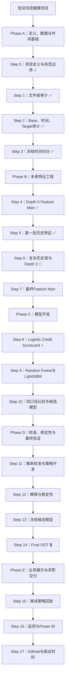
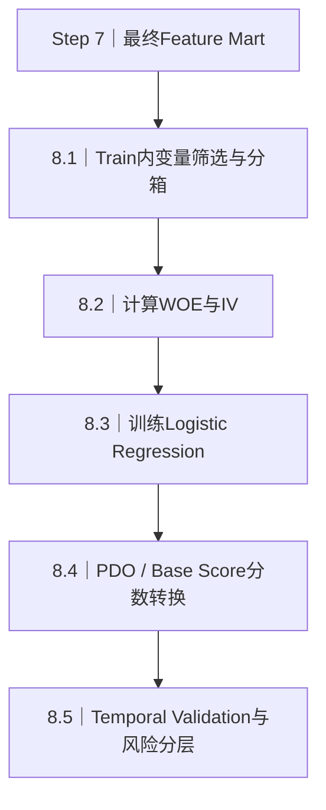

# 项目树状路线图｜Credit Risk Modeling Roadmap

> 目标：把约 26GB 的 Home Credit 多表 Parquet 数据，转化为可复现的 case-level Feature Mart，并完成信用评分卡、机器学习挑战模型、时间外验证、稳定性监控和离线策略回放。

**当前进度：Phase B，Step 5 已运行，正进入 Step 6。**

- ✅ 已完成：Step 0–4
- 🔵 当前交接点：Step 5 → Step 6
- ⭐ 信用评分卡：Step 8
- 🔒 Final OOT：Step 14，候选模型冻结后只打开一次

## 1. 全流程树状图



## 2. 当前到底在做什么

当前不是在训练评分卡，也不是在调 LightGBM。现在仍处于**多表特征工程阶段**：把一对多的历史记录压缩成一行一个 `case_id` 的统计特征。

仓库中的现有证据：

- `04_depth0_feature_mart.ipynb` 已生成开发期 Depth 0 宽表：**1,401,854 行 × 225 列**。
- `05_depth_history_features.ipynb` 已处理 `applprev_1/2`，接入后的工作宽表为 **1,401,854 行 × 338 列**。
- 已生成 `debitcard_1`、`deposit_1`、`other_1`、`tax_registry_b_1`、`tax_registry_c_1` 等表级特征文件。
- 这些结果说明第一批历史特征已完成，但还不能说明所有复杂历史表已经合并成最终 Feature Mart。

因此下一条主线是：

```text
剩余复杂表聚合
    → 合并全部表级特征
        → 模型就绪处理
            → 信用评分卡
                → LightGBM
```

## 3. 每一步做什么、用什么工具

| Phase | Step | 状态 | 核心任务 | 主要工具 | 关键产出 |
|---|---:|---|---|---|---|
| A | 0 | ✅ | 定义预测单位、时间锚点、target证据边界 | Markdown、GitHub | Project Charter、Target Evidence |
| A | 1 | ✅ | 盘点Parquet文件、表组和Depth层级 | Jupyter、Python、pandas、PyArrow | `file_inventory.csv`、`table_catalog.md` |
| A | 2 | ✅ | 检查base粒度、时间字段和target分布 | Jupyter、Python、pandas、Matplotlib | `02_base_time_target_audit.ipynb`、审计报告 |
| A | 3 | ✅ | 冻结Train、Tuning、Calibration、Final OOT | Python、Jupyter、YAML、Git | `configs/split_v1.yaml` |
| B | 4 | ✅ | 合并Depth 0静态表，形成第一版宽表 | DuckDB、SQL、Python、Parquet | `depth0_feature_mart_dev_v1.parquet`、SQL、YAML清单 |
| B | 5 | ✅ | 聚合第一批Depth 1/2历史表 | DuckDB、SQL、Python、Parquet | 表级历史特征文件、`05_depth_history_features.ipynb` |
| B | 6 | 🔵 下一步 | 处理 `credit_bureau_a/b`、`person`、`tax_registry_a` 及剩余Depth 2 | DuckDB、SQL、Python、Parquet | `06_complex_history_features.ipynb`、表级特征文件 |
| B | 7 | ⏳ | 合并全部特征并做最小必要的模型就绪处理 | DuckDB、SQL、pandas、YAML | 最终 Feature Mart、特征字典、训练字段清单 |
| C | 8 | ⭐ | 分箱、WOE/IV、Logistic、分数转换和风险分层 | pandas、scikit-learn、OptBinning（可选）、Matplotlib | Scorecard模型、分箱表、WOE映射、评分公式 |
| C | 9 | ⏳ | 训练Random Forest和LightGBM挑战模型 | scikit-learn、LightGBM | 模型文件、参数记录、验证集预测 |
| C | 10 | ⏳ | 同一切分下比较模型并选择候选模型 | Python、AUC/KS/PR-AUC/Brier、Matplotlib | 模型比较报告、候选模型决策 |
| D | 11 | ⏳ | 在独立区间做概率校准、风险分层和cutoff设计 | scikit-learn calibration、Python | 校准器、风险等级、策略阈值 |
| D | 12 | ⏳ | 检查解释性、周度性能和分布漂移 | SHAP、Logistic系数、PSI、pandas | 解释图、稳定性报告、监控指标 |
| D | 13 | ⏳ | 冻结数据、特征、模型、校准和策略版本 | Git/GitHub、YAML、joblib | 冻结commit、模型卡、版本清单 |
| D | 14 | 🔒 | 在Week 82–91执行一次Final OOT评估 | 冻结推理脚本、Python、Matplotlib | Final OOT报告；禁止再次调参 |
| E | 15 | ⏳ | 比较不同cutoff下的通过率和target捕获率 | Python、pandas、SQL | Offline policy replay报告 |
| E | 16 | ⏳ | 建立稳定性监控表和管理看板 | SQL、DuckDB、Power BI、Matplotlib | PSI/AUC/KS/校准/缺失率Dashboard |
| E | 17 | ⏳ | 整理GitHub首页、项目报告和面试讲解 | GitHub、Markdown、图表 | README、5分钟讲解、简历项目描述 |

## 4. 信用评分卡具体在哪一步实现

评分卡在 **Phase C — Step 8** 正式实现。它必须等待 Step 7 的最终 Feature Mart 和训练字段清单冻结，不能直接在尚未完成的历史特征表上训练。



### Step 8.1｜变量筛选与分箱

- 只使用 Model Train：Week 0–61。
- 处理缺失值、异常值、低方差、高缺失和强相关变量。
- 对连续变量做可解释分箱，优先保证区间稳定和风险趋势合理，不追求过度细分。

### Step 8.2｜WOE与IV

- 使用训练集拟合每个变量的分箱规则。
- 计算每个箱的 WOE 和变量 IV。
- 验证集、校准集和 Final OOT 只能应用训练集规则，不能重新拟合。

### Step 8.3｜Logistic Regression

- 用 WOE 特征训练 Logistic Regression。
- 检查系数符号、共线性、变量数量和稳定性。
- 输出 target-event probability；在标签业务定义未证实时，不自动称为某期限PD。

### Step 8.4｜信用分转换

将 Logistic 输出映射为信用分：

```text
Score = Offset + Factor × log(odds)
Factor = PDO / ln(2)
```

需要明确 Base Score、Base Odds、PDO 和“高分代表低风险还是高风险”。

### Step 8.5｜时间验证与风险分层

- 在 Tuning Validation：Week 62–71 评价。
- 报告 AUC、Gini、KS、PR-AUC、Brier Score、校准曲线和周度稳定性。
- 将分数划分为风险等级，为后面的cutoff与策略回放提供输入。

建议产出：

```text
notebooks/08_scorecard_baseline.ipynb
models/scorecard_v1.joblib
artifacts/scorecard/binning_table.csv
artifacts/scorecard/woe_mapping.csv
artifacts/scorecard/scorecard_points.csv
reports/08_scorecard_baseline.md
```

## 5. 评分卡与LightGBM是什么关系

| 项目 | 信用评分卡 | LightGBM |
|---|---|---|
| 项目角色 | 可解释传统基准模型 | 非线性机器学习挑战模型 |
| 输入 | 分箱后的WOE特征 | 原始/工程化数值与类别特征 |
| 优势 | 可解释、易转分、适合风险分层 | 能学习复杂非线性与变量交互 |
| 局限 | 非线性表达能力有限 | 解释和校准要求更高 |
| 验证要求 | 相同时间切分与相同指标 | 相同时间切分与相同指标 |
| 项目顺序 | 先完成 | 后完成 |

本项目不是用 LightGBM 替代评分卡，而是让二者在同一口径下比较。最终选择不能只看单一 AUC，还要考虑 KS、PR-AUC、概率质量、周度稳定性、解释性和运行成本。

## 6. 各工具在项目中的位置

| 工具 | 主要用途 | 重点步骤 |
|---|---|---|
| Jupyter Notebook | 分阶段运行、展示中间结果、记录实验 | Step 1–15 |
| VS Code | 重构Python/SQL、维护工程目录和配置文件 | Step 4以后 |
| DuckDB | 直接扫描Parquet、聚合大表、执行JOIN | Step 4–7、16 |
| SQL | 表内聚合、父子表汇总、Feature Mart连接、监控取数 | Step 4–7、15–16 |
| pandas / PyArrow | 轻量数据处理、读写Parquet、模型输入准备 | Step 1–15 |
| scikit-learn | Logistic、Random Forest、指标、校准 | Step 8–14 |
| OptBinning | 评分卡分箱、WOE/IV；不是必须依赖 | Step 8 |
| LightGBM | 非线性挑战模型 | Step 9–14 |
| SHAP | 解释候选树模型 | Step 10、12 |
| Matplotlib | 审计图、模型比较、校准和稳定性图 | Step 2、8–16 |
| Power BI | 最终监控与业务展示看板 | Step 16 |
| GitHub Desktop | 本地仓库与GitHub之间同步 | 全流程 |
| GitHub | 版本记录、README和求职展示 | 全流程 |

## 7. 为避免再次陷入过度审计

Step 6–7 每张表只保留三类强制检查：

1. 聚合后是否一行一个 `case_id`；
2. 时点过滤是否生效，是否使用决策时点之后的信息；
3. 连接前后主表行数是否保持不变。

其他检查只有在结果异常、字段含义不清或模型表现异常时再补做。当前目标是先形成完整工程闭环，而不是模拟银行内部的全量治理体系。

## 8. 接下来按这个顺序执行

1. 新建 `06_complex_history_features.ipynb`，处理剩余复杂历史表。
2. 新建 `07_final_feature_mart.ipynb`，合并全部表级特征并冻结模型字段。
3. 新建 `08_scorecard_baseline.ipynb`，正式完成信用评分卡。
4. 再进入 Random Forest、LightGBM、校准、稳定性和 Final OOT。

> 核心顺序：**先把Feature Mart做完整，再做评分卡；先做评分卡，再做LightGBM；模型冻结后，最后才打开Final OOT。**
